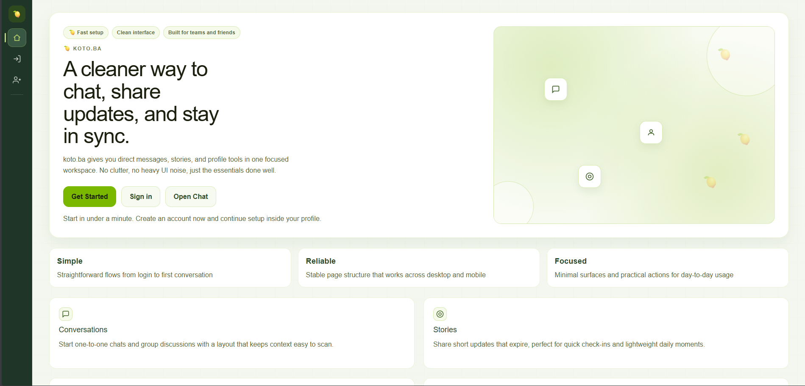
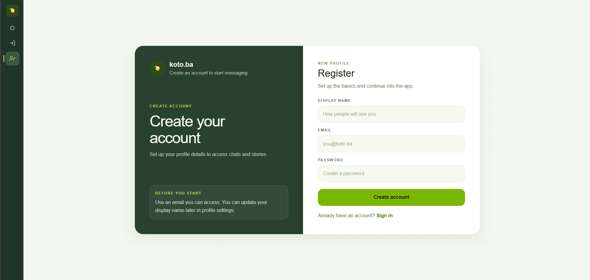
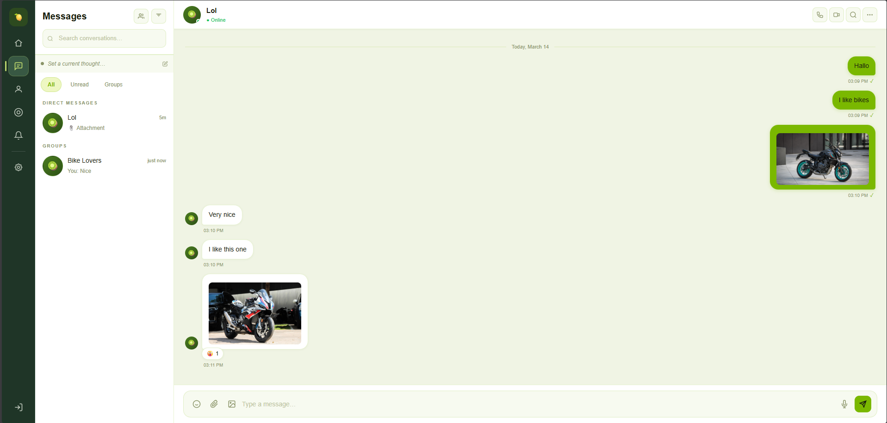
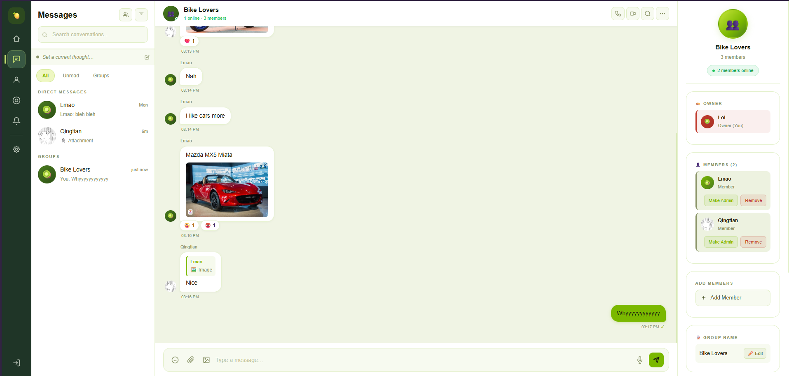
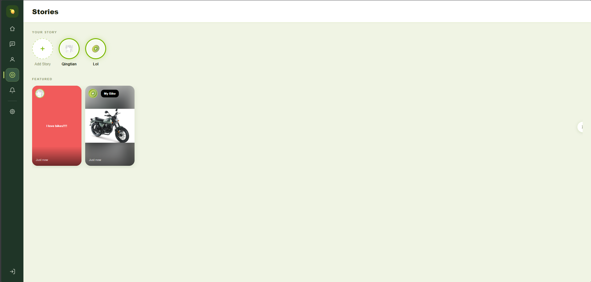
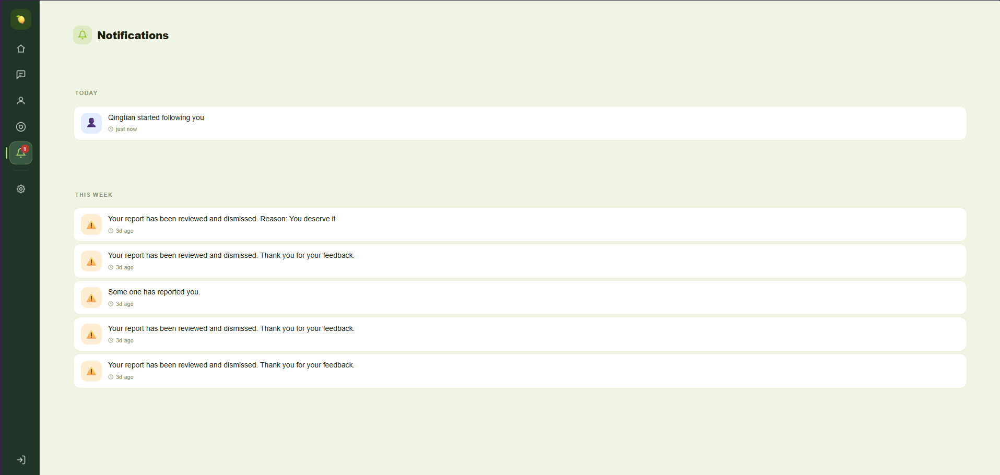
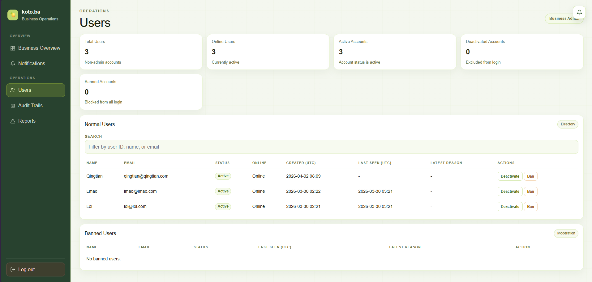
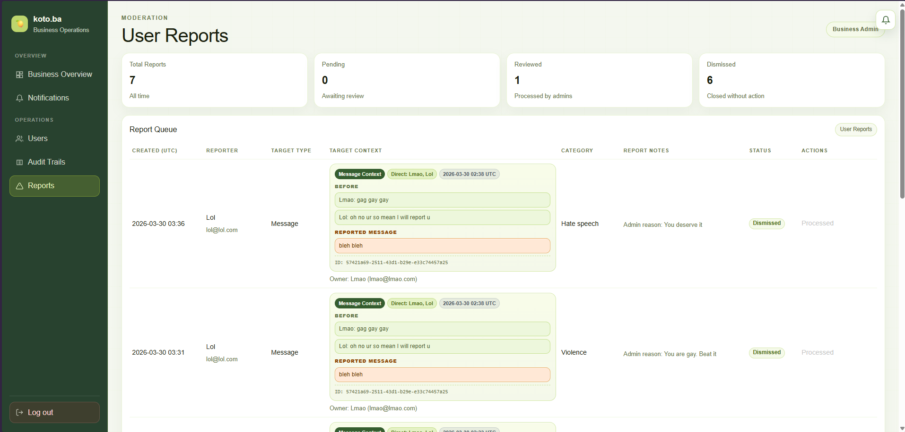

# koto.ba

koto.ba is a real-time social messaging app for teams and friends. It focuses on clean chat, lightweight sharing, and practical moderation without UI clutter.

## What You Can Do

- Chat in direct and group conversations
- See real-time typing, reactions, and online presence
- Share expiring stories and profile updates
- Manage notifications and privacy preferences
- Use admin dashboards for reports, audits, and security alerts

## Screenshots

















## Built With

- ASP.NET Core 8 + Blazor Server
- Entity Framework Core + SQL Server
- ASP.NET Core Identity (role-based auth)
- SignalR for chat and notification real-time updates

Main app: [Kotoba](Kotoba)

## Quick Start

### Prerequisites

- .NET 8 SDK
- SQL Server available for [Kotoba/appsettings.json](Kotoba/appsettings.json) connection string

### Run

```bash
dotnet restore
dotnet run --project Kotoba/Kotoba.csproj
```

The app applies EF Core migrations automatically on startup.

### Dev Root Admin

Configured in [Kotoba/appsettings.json](Kotoba/appsettings.json):

- Email: `root@koto.ba`
- Password: `123`
- Login: `/admin/login`

## Main Routes

- `/` home
- `/register` and `/login`
- `/chat`
- `/story`
- `/profile`, `/settings`, `/notifications`
- `/admin/system/dashboard`, `/admin/business/dashboard`

## Repository

- [Kotoba](Kotoba): app code (components, modules, hubs)
- [docs](docs): notes and UI examples
- [Kotoba.sln](Kotoba.sln): solution file
